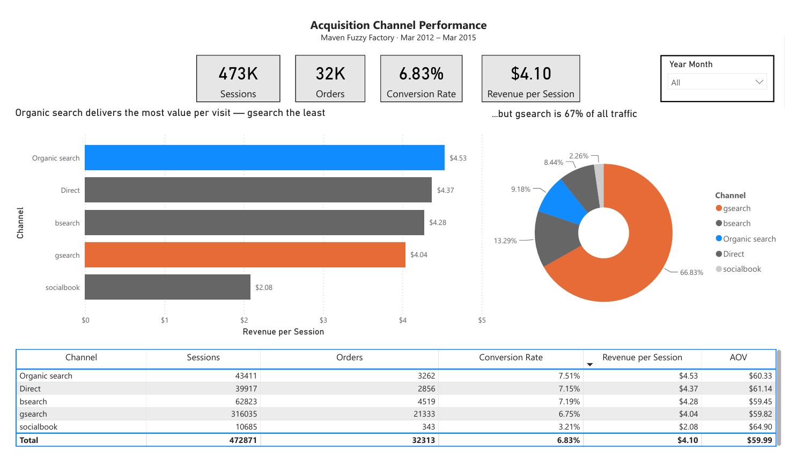
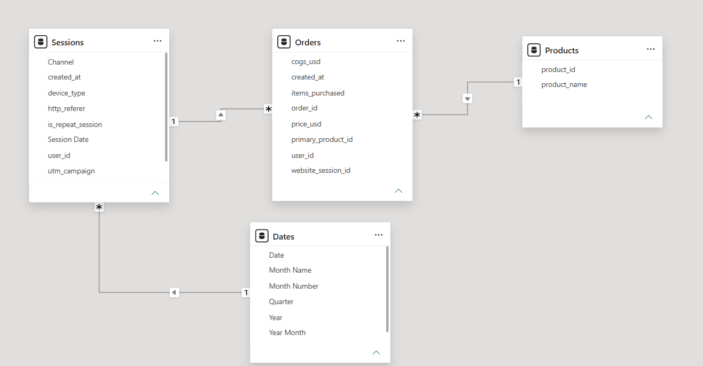

# D2C Acquisition Channel Performance

A Power BI dashboard analysing which acquisition channels bring genuinely valuable traffic to a direct-to-consumer e-commerce business, not just the most of it.

## The question

For a D2C business without a subscription model, revenue depends on acquiring visitors who convert and return. Traffic volume alone is a misleading measure of channel quality: a channel can dominate sessions while delivering the least value per visit.

So: which channels are actually worth acquiring from, and where is spend going to the wrong place?

## The finding

**The largest channel is the weakest.** Paid search (gsearch) accounts for 67% of all sessions but delivers $4.04 revenue per session, the lowest of any search channel, against $4.53 for organic.

The gap is conversion, not customer value. gsearch converts at 6.75% while its average order value ($59.82) sits mid-pack. Those visitors spend normally when they buy; they just buy less often. That points at search intent or landing page fit rather than the wrong audience.

Two secondary observations:

- **Organic search is the best performer** at $4.53 per session, 12% above the dominant paid channel, and effectively free traffic.
- **Paid social is the outlier.** Highest AOV at $64.90, but 3.21% conversion, less than half every other channel. Revenue per session of $2.08 is half the site average. High reach, low intent.

## Data

[Maven Analytics Data Playground](https://mavenanalytics.io/data-playground), Toy Store E-Commerce Database. Public sample data covering approximately 473,000 sessions and 32,000 orders, March 2012 to March 2015.

Source CSVs are not committed to this repo. Download them from the link above.

## Approach

**Prepare.** Loaded website_sessions, orders and products from CSV. website_pageviews was deliberately excluded: it is by far the largest table and only supports page-level funnel analysis, which this question does not require.

Derived a Channel column from utm_source and http_referer rather than using utm_source alone. Untagged traffic with a referrer is organic search; untagged traffic without one is direct. Merging them would have combined two channels with entirely different acquisition costs.

**Model.** Star schema with Dates and Products as dimensions, Sessions and Orders as facts. All relationships one-to-many, single cross-filter direction. A single date relationship covers both fact tables, since date filters flow Dates to Sessions to Orders.

**Measures.** All aggregations written as explicit DAX measures in a dedicated _Measures table. DIVIDE used throughout for safe division. Revenue per Session is the headline metric: it combines conversion rate and order value into a single figure directly comparable to acquisition cost.

## Data quality issues found

**Literal "NULL" strings.** The source CSVs encode missing values as the text "NULL" rather than empty fields. Left untreated this created a phantom "NULL" channel and excluded all organic and direct traffic from channel analysis. The conditional logic explicitly rejects the string as well as true nulls and empty strings.

**Datetime join failure.** Sessions[created_at] is a datetime; the date table holds plain dates. The relationship formed without error but matched nothing, producing blanks rather than a failure message. Resolved by deriving a date-only column in Power Query. Caught by validating that a date slicer actually changed the order count, not by any error surfacing.

Both were silent failures. Neither would have been visible without checking output against expectation.

## Files

| File | Description |
|---|---|
| d2c-funnel-dashboard.pbix | Power BI Desktop file: model, measures, report |
| d2c-funnel-dashboard.pdf | Static export |
| images/overview.png | Dashboard screenshot |

## Limitations

- Public sample data, not a real business. Findings illustrate method, not a real market.
- Acquisition cost is not in the dataset, so revenue per session cannot be converted into true ROI.
- order_items and order_item_refunds were not loaded; refund rate is therefore out of scope.

## Tools

Power BI Desktop, Power Query (M), DAX